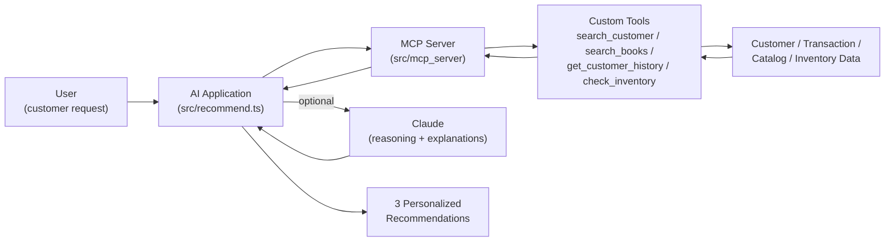

# AI-Powered Book Recommendation System

AI-powered recommendation workflow using customer preferences, transaction history, inventory availability, custom tools, and MCP integration.

> **Note on data:** this is a portfolio version of a production system. All data in this repository (`data/*.csv`) is 100% synthetic — fake customer IDs, invented book titles, invented transactions. No real customer information, order history, or catalog data is included. See [Data privacy](#data-privacy) below.

## Business Problem

Selecting personalized books manually from a large catalog is time-consuming and requires reviewing a customer's previous selections, preferences, and current inventory.

## Solution

I designed and built an AI-powered recommendation application that connects to customer history and catalog data through custom tools and an MCP server.

For **returning customers**, the system:
- retrieves historical orders (borrows/purchases);
- identifies preferences from the categories of books they've engaged with;
- removes previously selected titles from consideration;
- checks current availability;
- returns three personalized recommendations.

For **new customers**, the system:
- accepts age and thematic preferences;
- searches available inventory for their age group;
- returns three relevant recommendations.

## Architecture



In production, `DATA` is the store's real database (customers, orders, inventory). In this demo, `DATA` is the synthetic CSV files in [`data/`](data/) — every other layer (tools, MCP server, recommendation logic) is the same code that runs in production.

The Claude reasoning step is optional: if `ANTHROPIC_API_KEY` is set, the app asks Claude to pick and explain the final 3 recommendations from the candidate shortlist; otherwise it falls back to rule-based scoring so the demo runs fully offline with no credentials.

## Project structure

```
data/                  synthetic customers.csv / books.csv / transactions.csv
public/                minimal browser UI (index.html / app.js / style.css)
src/
  data.ts              CSV loading (swap for a DB client in production)
  tools/
    searchCustomer.ts
    searchBooks.ts
    getCustomerHistory.ts
    checkInventory.ts
  mcp_server/
    server.ts          MCP server exposing the tools above over stdio
  mcp_client_demo.ts    real MCP client -> server round trip over stdio
  recommend.ts          recommendation engine (rule-based + optional Claude pass)
  demo.ts               CLI entry point for the two demo scenarios
  web_server.ts          minimal HTTP server backing the browser UI
```

## Running the demo

### In the browser

```bash
npm install
npm run web
```

Then open [http://localhost:4000](http://localhost:4000) — pick "Existing customer" (choose one of the demo customer IDs) or "New customer" (enter an age and a few interests) and see live recommendations, backed by the same `src/recommend.ts` engine and synthetic data described above.

### On the command line

```bash
npm install
npm run demo:existing -- C002
npm run demo:new -- --age 6 --interests dinosaurs,science
```

Optionally, copy `.env.example` to `.env` and set `ANTHROPIC_API_KEY` to enable the Claude reasoning/explanation pass; without it, recommendations use the rule-based fallback.

To run the MCP server standalone (e.g. to connect it to Claude Desktop or another MCP client) instead of calling the tool functions directly:

```bash
npm run mcp-server
```

To see a real MCP client talk to that server over stdio (list tools, call `get_customer_history` and `search_books`) rather than importing the tool functions directly:

```bash
npm run mcp-client-demo
```

## Demo output

**Existing customer** — profile built from transaction history, previously-read titles excluded:

```
$ npm run demo:existing -- C002

Customer C002
Preferences (from history): Nature, Adventure, Animals
Recommended:
  1. The Night Train to Somewhere [Adventure] (B041)
     Matches this customer's interest in adventure, based on past borrows/purchases.
  2. Space Explorers [Science] (B002)
     Popular pick in this customer's age group that they haven't read yet.
  3. Starlight Voyage [Space] (B005)
     Popular pick in this customer's age group that they haven't read yet.
```

**New customer** — no history, recommendations from stated age and interests:

```
$ npm run demo:new -- --age 6 --interests dinosaurs,science

New customer, age 6 (age group 5-7)
Interests: dinosaurs, science
Recommended:
  1. The Last Dinosaur Egg [Dinosaurs] (B027)
     Matches the stated interest in dinosaurs.
  2. Seeds of Wonder [Science] (B040)
     Matches the stated interest in science.
  3. The Last Triceratops [Dinosaurs] (B046)
     Matches the stated interest in dinosaurs.
```

No store name, real customer, or real book title appears anywhere in this repository or its output.

## Data privacy

The production environment this design is based on holds approximately 1,500+ registered customers and 3,500+ books, backed by a real database with customer PII (names, contact info, order history) and proprietary catalog data. **None of that is present here.** This portfolio version uses completely synthetic data (fabricated customer IDs, invented book titles, invented transactions) to protect business and customer information, and demonstrates the same architecture and logic that runs in production.

## Outcome

The production application generates three personalized recommendations per customer in approximately five minutes of staff time saved versus manual lookup.

## License

[MIT](LICENSE)
